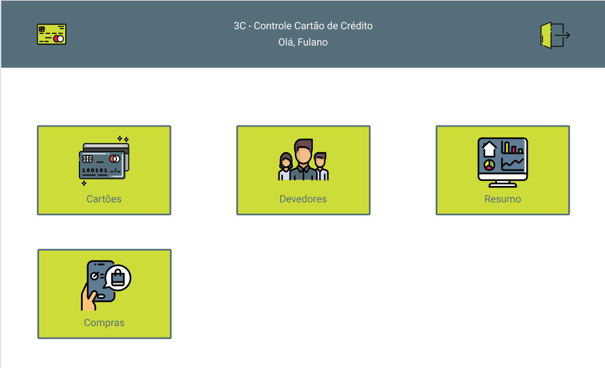
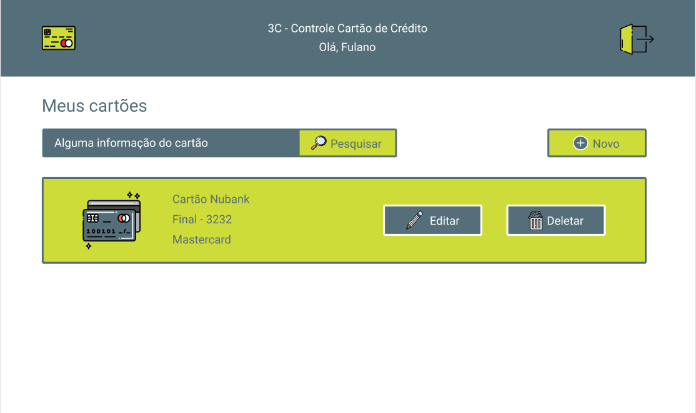
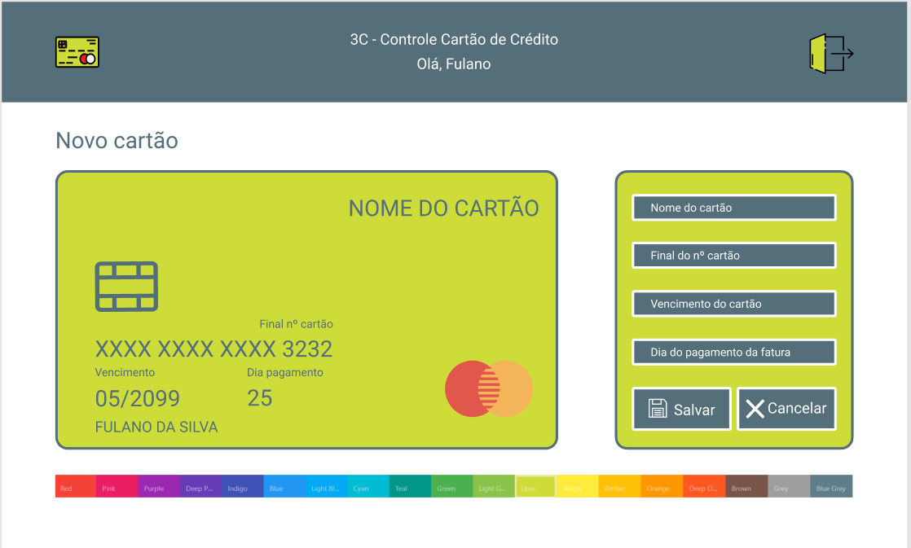
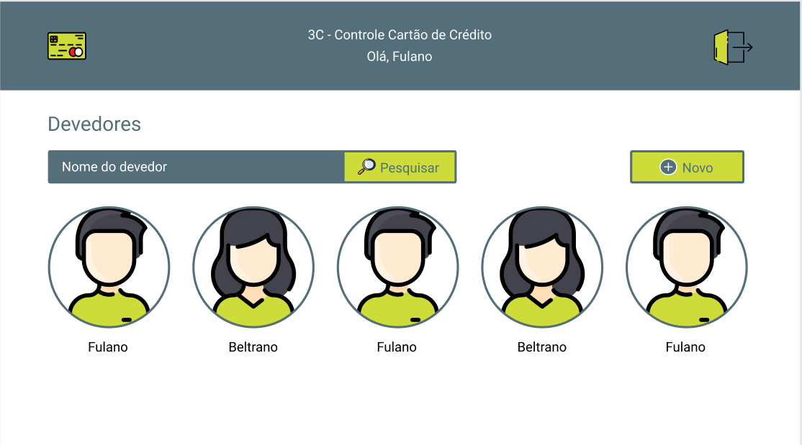
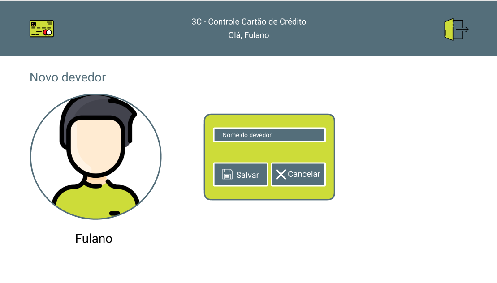
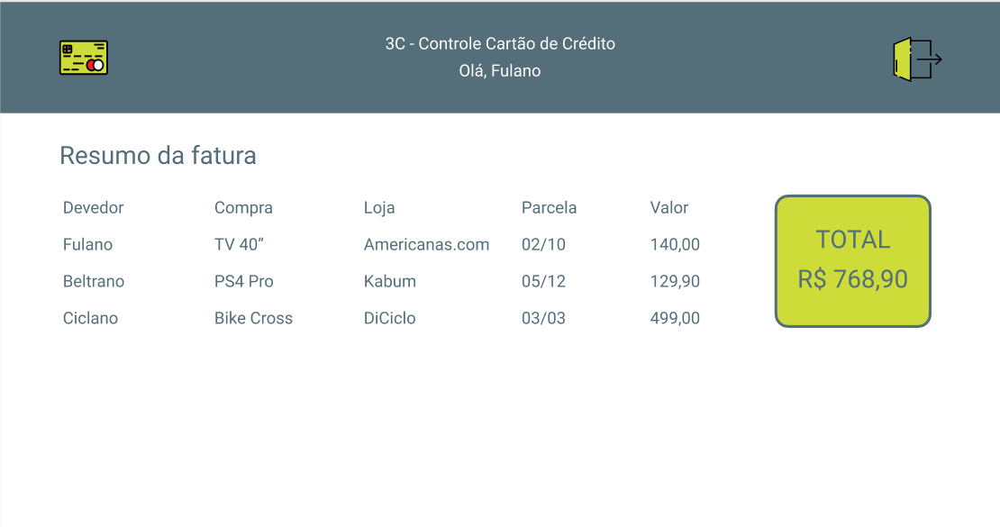
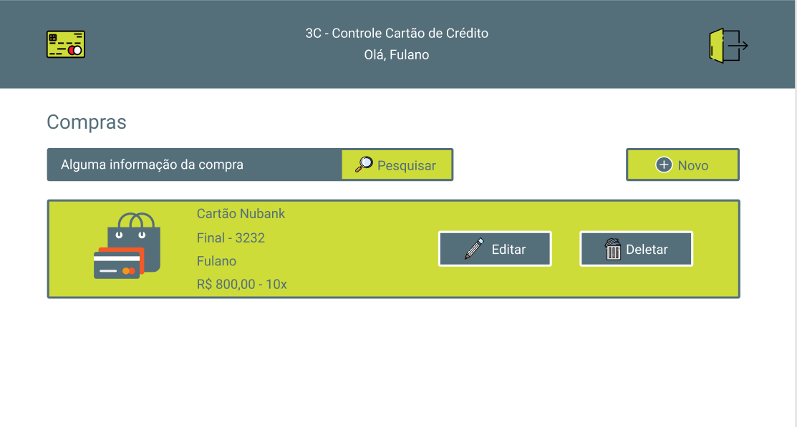
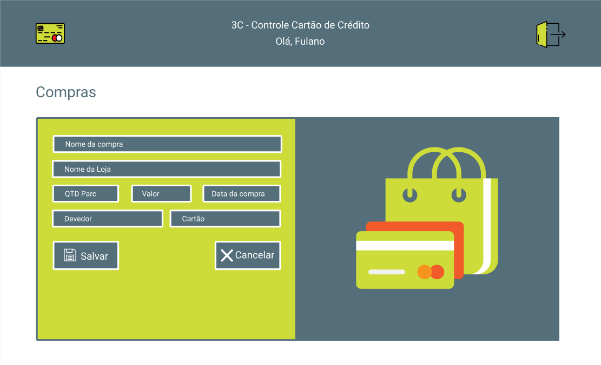

# 3C - CONTROLE CARTÃO CRÉDITO

# 📖 Sobre

Este é o Front-End criado para integrar na API do 3C.

Esta é um release inicial, v0.1, com o intuito apenas de válidar o MVP. Mais melhorias estão sendo implementadas no código, e serão implementadas com o tempo.

# 🖼 Imagens

<table>
  <tr>
    <th></th>
    <th></th>
  </tr>
  <tr>
    <th></th>
    <th></th>
  </tr>
  <tr>
    <th></th>
    <th></th>
  </tr>
  <tr>
    <th></th>
    <th></th>
  </tr>
  <tr>
    <th></th>
    <th></th>
  </tr>
  
</table>

# 🔨 Ferramentas

- ReactJs
- Polished
- React-Router-Dom
- Styled-Components
- YUP
- Date-fns
- Unform e etc.

# 🏗 Instalação

- Clone o projeto

```
git clone https://github.com/maxleon52/3c-web.git
```

- Entre na pasta criada e rode yarn ou npm install

```
cd 3c-web
yarn
```

- Rode yarn start

```
yarn start
```

PS: A aplicação ainda está em desenvolvimento!
